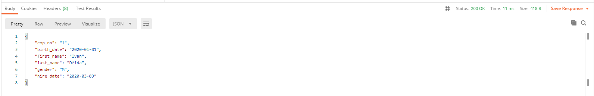

<h1>Za demonstraciju koristim pretragu korisnika po emp_no. Pretražujemo korisnika sa emp_no = 1
Ukoliko korisnik ne proslijedi username i password dobiti će "Unauthorized" poruku. Što možemo vidjeti na 1. i 2. slici
Kada korisnik unese odgovarajući username i password dobiva normalan response.
</h1>

<h2> 1. slika</h2>

<h2> 2. slika</h2>

<h2> 3. slika</h2>

<h2> 4. slika</h2>

