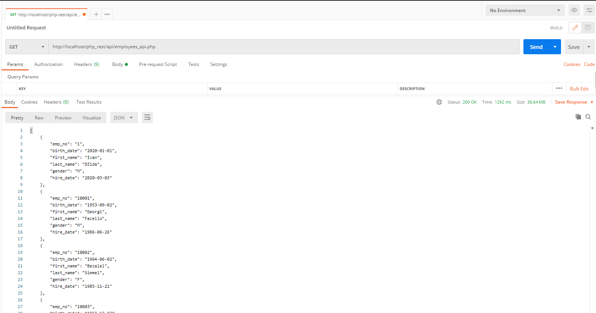

<h3>REST CRUD operacije u php-u</h3>

<h4>Get all employees<h4>
  

<h4>Get employee by ID<h4>
  
 
 
 <h4>Create new employee<h4>
  
 
 
 
 <h4>Update employee<h4>
  
 
 
 <h4>Delete employee<h4>
 
 
